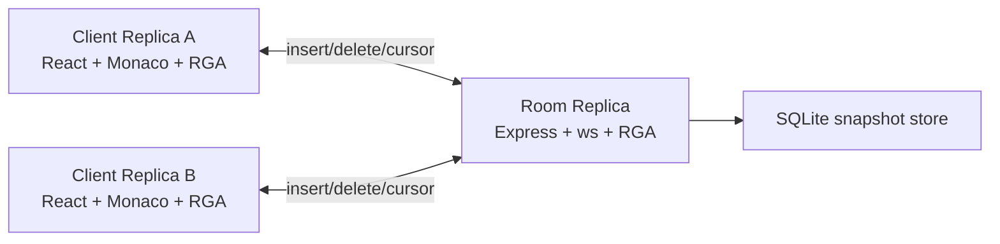
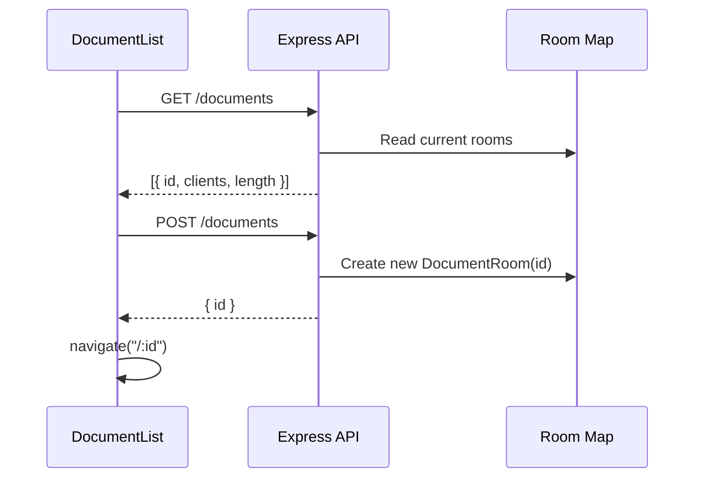
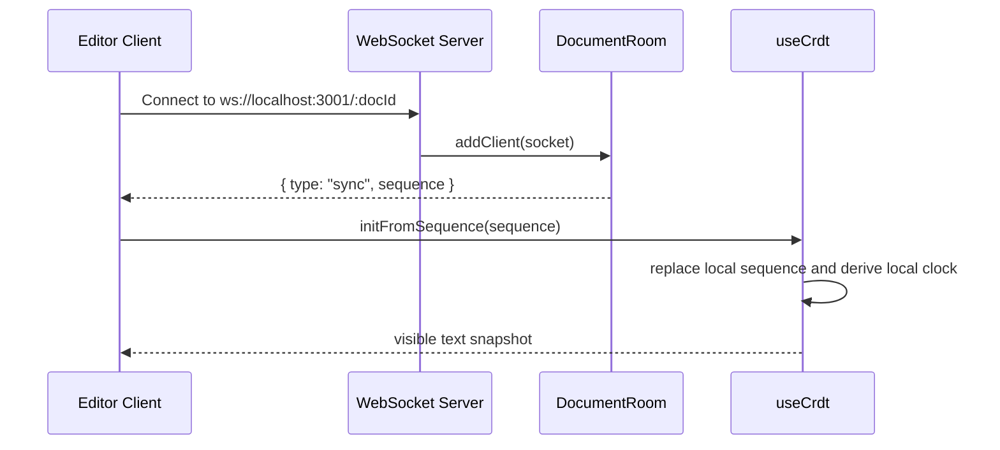
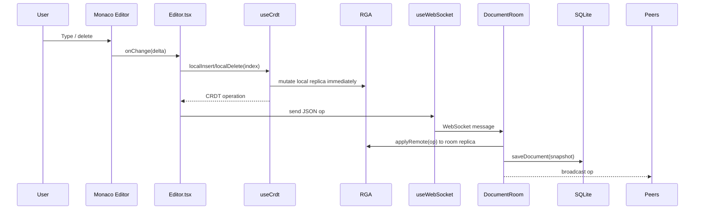
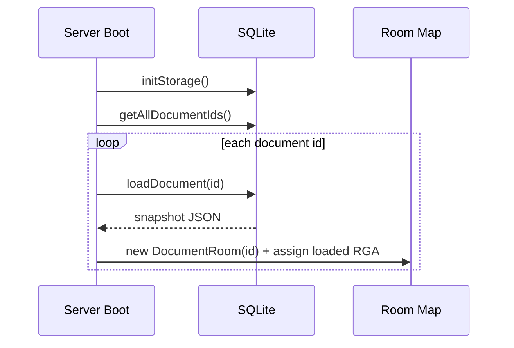

# Collaborative Editor Architecture

This document describes the architecture implemented in the repository today. It is grounded in the current code under `packages/client`, `packages/server`, and `packages/crdt-core`, including the runtime flows for synchronization, persistence, and recovery.

## 1. System Overview

The project is a TypeScript monorepo with three runtime layers:

1. `@crdts/client`
   React + Vite single-page app that renders the editor UI, creates a per-tab CRDT replica, and exchanges operations over WebSocket.
2. `@crdts/server`
   Express + `ws` server that owns in-memory document rooms, applies incoming CRDT operations to the room replica, persists room snapshots to SQLite, and broadcasts operations to peer clients.
3. `@crdts/crdt-core`
   Shared CRDT library implementing an operation-based Replicated Growable Array (RGA) for text.

At runtime, every open browser tab has its own CRDT replica, and every server room has another replica. All replicas converge by applying the same insert/delete operations.



## 2. Repository Topology

### `packages/crdt-core`

The shared domain package is the mathematical core of the system.

- `src/rga.ts`
  Implements the `RGA` class, local operation generation, remote operation application, visible text rendering, out-of-order buffering, and tombstone handling.
- `src/char.ts`
  Defines `CharId` and `CRDTChar`.
- `src/operation.ts`
  Defines `InsertOp`, `DeleteOp`, and `CRDTOperation`.
- `src/__tests__/rga.test.ts`
  Covers convergence, concurrent edits, out-of-order insert dependencies, and delete-before-insert cases.

### `packages/server`

The server is the collaboration hub for rooms and persistence.

- `src/index.ts`
  Boots Express and the WebSocket server, exposes document HTTP endpoints, loads persisted documents into memory at startup, and attaches sockets to rooms.
- `src/room.ts`
  Encapsulates per-document state: one `RGA`, a socket set, initial sync, broadcast logic, and persistence triggering.
- `src/storage.ts`
  Stores and restores room snapshots in SQLite using a single `documents` table.

### `packages/client`

The client is responsible for UI interaction, local-first editing, and remote event application.

- `src/App.tsx`
  Configures routes for the document list and per-document editor pages.
- `src/components/DocumentList.tsx`
  Lists known rooms from the server and creates new rooms.
- `src/components/Editor.tsx`
  Binds Monaco editor events to CRDT operations and renders remote cursor decorations.
- `src/hooks/useCrdt.ts`
  Wraps one `RGA` instance per browser tab and exposes local/remote mutation helpers.
- `src/hooks/useWebSocket.ts`
  Manages socket connection state, reconnect backoff, sync handling, and message dispatch.

## 3. Runtime Component Responsibilities

### Client

The client owns the user interaction loop.

- Creates a stable `siteId` once per editor route mount.
- Applies local edits immediately by mutating its own CRDT before network round-trip.
- Sends only operations, not full document snapshots, for normal editing.
- Applies remote operations as Monaco delta edits so peer changes do not replace the whole buffer.
- Maintains ephemeral cursor-presence UI for other peers.

### Server

The server is not purely a dumb relay in the current implementation. It has three active responsibilities:

- Maintains an in-memory `RGA` replica for each document room.
- Applies every inbound insert/delete operation to that room replica.
- Persists the updated room snapshot to SQLite after each operation.

This means the server is the source for:

- Initial sync payloads sent to newly joined clients.
- Recovery after process restart, by reloading snapshots from SQLite into room memory.
- Room metadata exposed over HTTP, such as active clients and visible text length.

### CRDT Core

The CRDT layer provides deterministic conflict handling without server-side transformation logic.

- Local inserts derive a parent pointer from visible editor position.
- Local deletes tombstone an existing character instead of removing it.
- Remote inserts can be buffered until their parent exists.
- Remote deletes can be cached until the target character arrives.
- Concurrent siblings are ordered deterministically by `siteId` and then `clock`.

## 4. Data Model

### Character Model

Each logical character is stored as:

```ts
interface CharId {
  siteId: string;
  clock: number;
}

interface CRDTChar {
  id: CharId;
  value: string;
  tombstone: boolean;
  parentId: CharId | null;
}
```

Key properties:

- `id` uniquely identifies the character globally.
- `parentId` encodes relative insertion order instead of relying on array index.
- `tombstone` preserves causal history after deletes.

### Operation Model

The network protocol for durable document updates is operation-based:

- `insert`
  `{ type: 'insert', id, value, parentId }`
- `delete`
  `{ type: 'delete', id }`

The client and server also use two non-CRDT message shapes:

- `sync`
  `{ type: 'sync', sequence }`
- `cursor`
  `{ type: 'cursor', siteId, position }`

### Persistence Model

SQLite stores one JSON snapshot per document in the `documents` table:

- `id TEXT PRIMARY KEY`
- `state JSON`

The serialized state currently contains:

- `siteId`
- `clock`
- `sequence`

The server persists full snapshots, not append-only operations.

## 5. End-to-End Dataflows

## A. Document Discovery and Room Creation



Notes:

- Empty rooms are created in memory immediately.
- Empty rooms are not persisted until at least one CRDT operation is processed.

## B. Initial Join and State Hydration



Important implementation detail:

- Join-time sync comes from the room's in-memory `RGA`, not from a fresh database read on every connection.
- Database reads happen at server startup when rooms are reconstructed.

## C. Local Edit Critical Path

This is the latency-sensitive path that determines typing responsiveness.



Why this path matters:

- The client updates locally before the network call, so user-perceived latency is mostly editor event handling plus local CRDT work.
- Server persistence is asynchronous relative to the broadcast loop, but it still occurs on every operation.
- Because edits are sent character-by-character, large paste operations expand into many individual insert operations.

## D. Remote Edit Application Critical Path

This path controls how quickly peers see each other's edits.

1. A peer receives an `insert` or `delete` WebSocket message.
2. `useWebSocket` routes it to `Editor.handleRemoteOp`.
3. `useCrdt.applyRemote` mutates the local `RGA`.
4. `RGA.applyRemote` returns one or more `RemoteOperationEvent`s.
5. `Editor.tsx` converts those events into Monaco `executeEdits('remote', edits)`.
6. Monaco updates only the affected ranges.

Why the implementation matters:

- The editor does not use full-buffer replacement for remote changes.
- `isApplyingRemote` prevents remote edits from echoing back through the local `onChange` path.
- Out-of-order operations can resolve into multiple editor edits once a missing parent arrives and backlog processing runs.

## E. Persistence and Restart Recovery



Recovery characteristics:

- Persisted documents are reloaded into memory on boot.
- New rooms with no edits do not survive restart because they were never saved.
- Persistence granularity is snapshot-per-operation, not event log replay.

## 6. Critical Paths

The most important paths to reason about in this codebase are:

### 1. Typing Path

`Monaco change -> local CRDT mutation -> WebSocket send`

This path is the main UX path. It must stay fast and non-blocking because it runs on every keystroke.

### 2. Fan-Out Path

`Server receive -> room applyRemote -> save snapshot -> broadcast peers`

This path determines collaboration throughput and server cost under concurrent editing.

### 3. Join Path

`Socket connect -> room sync -> client initFromSequence -> Monaco initial value`

This path determines first-load correctness and reconnection correctness.

### 4. Convergence Path

`Remote op arrives out of order -> backlog/cache -> eventual apply`

This path is the heart of CRDT correctness. It is what allows replicas to converge despite network reordering.

### 5. Restart Recovery Path

`SQLite snapshot -> room reconstruction -> sync to next client`

This path determines whether edits survive process restarts.

## 7. Correctness Invariants

The architecture depends on a few invariants staying true:

### Replica Convergence

All replicas should converge if they eventually receive the same operation set. The test suite validates this for representative concurrent and reordered cases.

### Stable Character Identity

Character IDs must be globally unique across sites. The current implementation uses per-tab random `siteId` plus a monotonically increasing local `clock`.

### Tombstone Preservation

Deleted characters must remain addressable so that delayed operations referring to them still make sense causally.

### Deterministic Sibling Ordering

Concurrent inserts sharing the same parent must resolve in the same order everywhere. The implementation currently orders siblings by `siteId` and then `clock`.

### Single Source of Join Snapshot

The room's in-memory replica is the state served to new clients. This makes correct room mutation on every server message essential.

## 8. Scalability and Operational Constraints

The current design is strong for a prototype or learning system, but a few constraints are architectural, not incidental:

### Full Snapshot Persistence Per Operation

Every insert/delete causes the server to serialize and upsert the entire room state. This is simple and durable, but write amplification will grow with document size and edit rate.

### In-Memory Room Residency

All active and previously loaded persisted rooms remain in the process memory map. There is no room eviction strategy yet.

### Character-Level Operation Granularity

Pastes and bulk edits are decomposed into many single-character operations, which increases message count, snapshot writes, and editor event churn.

### Presence Is Ephemeral

Cursor messages are forwarded only to currently connected peers and are never persisted. There is also no explicit "cursor left" event, so stale cursor state must be handled at the UI layer if presence becomes more advanced.

### No Authentication or Authorization

Document IDs function as room identifiers only. There is no access control around HTTP or WebSocket endpoints.

### Fixed Local Endpoints in Client

The client is currently hard-coded to `http://localhost:3001` and `ws://localhost:3001`, which is fine for local development but not for multi-environment deployment.

## 9. Known Gaps Between Vision and Current Implementation

These are useful when discussing roadmap or future architecture:

- The system is local-first, but it does not yet queue unsent operations while disconnected.
- The server still participates in state reconstruction and persistence, so it is not purely stateless infrastructure.
- Storage is snapshot-based rather than append-only op log based.
- Presence is cursor-only and best-effort.
- There is no garbage collection for tombstoned characters.

## 10. Recommended Next Architecture Steps

If this project evolves beyond a prototype, the highest-leverage next steps are:

1. Move client and server URLs into configuration.
2. Batch or debounce persistence instead of saving a full snapshot per operation.
3. Separate room metadata from full document state to reduce `/documents` cost.
4. Add explicit reconnect and offline-send strategy if offline editing becomes a product requirement.
5. Introduce tombstone compaction or snapshot compaction strategy for long-lived documents.
6. Add auth and room access controls before any shared deployment.
