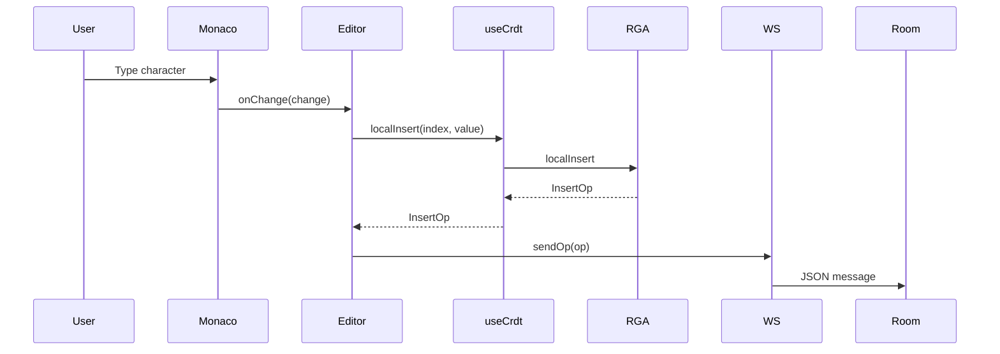
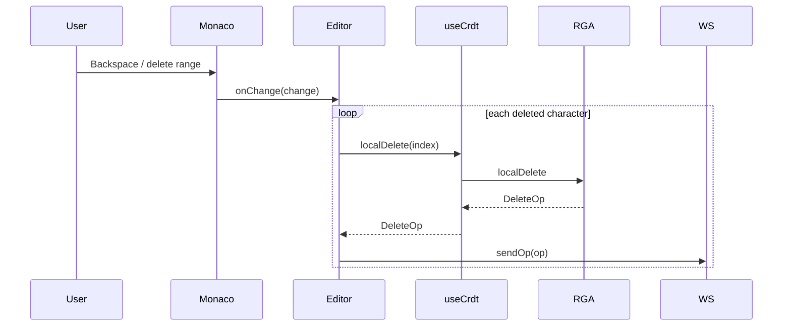
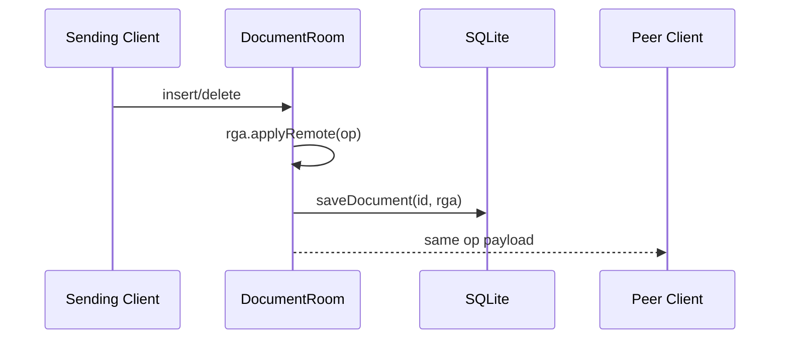
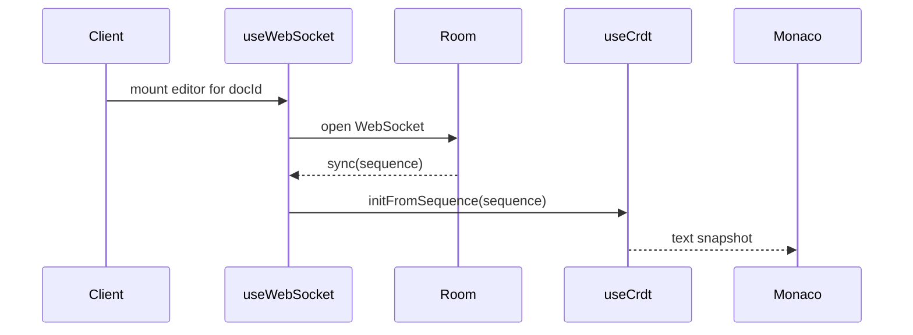

# Dataflows and Critical Runtime Paths

This document focuses on the operational flows through the system. For package responsibilities and structural boundaries, see [ARCHITECTURE.md](./ARCHITECTURE.md).

## 1. Message Types

The running system exchanges four message classes:

| Message | Sender | Receiver | Persisted | Purpose |
| --- | --- | --- | --- | --- |
| `insert` | client | server, then peer clients | yes, inside room snapshot | Add one character after a parent |
| `delete` | client | server, then peer clients | yes, inside room snapshot | Tombstone one character |
| `sync` | server | newly connected client | no | Send current full sequence |
| `cursor` | client | peer clients via server | no | Broadcast ephemeral presence |

## 2. Local Insert Flow

Details:

- The visible index from Monaco is converted directly into CRDT insertion position.
- The local replica updates first, so the user sees the character before the network round-trip completes.
- Multi-character input is sent as one operation per character.

## 3. Local Delete Flow

Details:

- Deletes are represented as tombstones, not structural removal.
- Range deletes become repeated single-character delete operations at the same visible index.

## 4. Server Fan-Out Flow

Details:

- The sender does not receive its own operation back.
- The room replica is updated before persistence and broadcast complete.
- Cursor messages skip CRDT application and persistence and are only forwarded.

## 5. Join and Reconnect Flow

Details:

- `useWebSocket` reconnects with exponential backoff up to 10 seconds.
- On reconnect, the client expects a fresh `sync` payload and rehydrates from room state.
- Initial editor population uses `setValue()` only for the first sync path; incremental remote updates use Monaco deltas.

## 6. Out-of-Order Dependency Resolution

The CRDT core contains two mechanisms that protect convergence when messages arrive out of order.

### Insert Backlog

If an insert arrives before its `parentId` exists locally:

1. The insert is pushed into `insertBacklog`.
2. No editor event is emitted yet.
3. When the parent eventually arrives, backlog processing retries pending inserts.

### Tombstone Cache

If a delete arrives before its target character exists locally:

1. The deleted `CharId` is stored in `tombstoneCache`.
2. When the matching insert later arrives, the char is inserted already tombstoned.
3. No visible flicker occurs because no insert event is emitted first.

## 7. Persistence Flow

The persistence path is snapshot-oriented:

1. Room state changes after every insert/delete.
2. The server serializes `siteId`, `clock`, and `sequence`.
3. SQLite upserts the full JSON blob into `documents`.

Implications:

- Persistence is simple and restart-safe.
- Large documents increase write cost because the full sequence is rewritten each time.

## 8. Critical Failure Boundaries

These are the main places where system behavior depends on careful handling:

### Editor-to-CRDT Boundary

If Monaco offsets and CRDT visible indexes diverge, local operations will target the wrong characters.

### CRDT-to-WebSocket Boundary

If operations are malformed or missing causal identifiers, replicas cannot converge.

### Room-to-Storage Boundary

If persistence fails, collaboration can still continue in memory, but restart recovery will lose recent state.

### Sync Boundary

If the initial `sync` payload is stale or incomplete, newly joined clients will start from the wrong replica state and may diverge until corrected.

## 9. Highest-Value Observability Points

If you instrument this system later, these points will tell you the most:

1. Time from Monaco local change to WebSocket send.
2. Time from server receive to peer broadcast.
3. SQLite write duration and failure rate.
4. Backlog size and tombstone-cache hits in the CRDT core.
5. Room count, room size, and client count per room.
